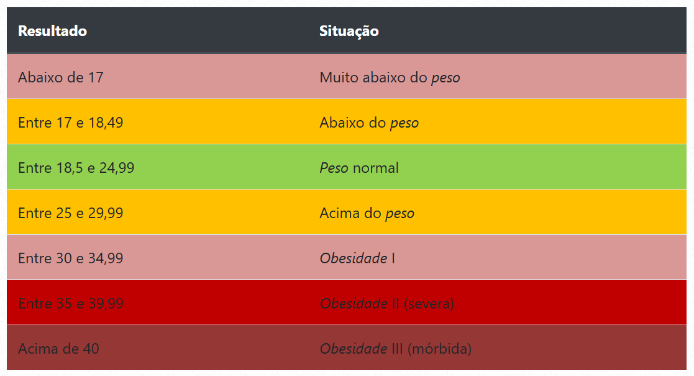

Calculadora de IMC em Python

Crie um programa em Python que calcule o Índice de Massa Corporal (IMC) com
base no peso e altura fornecidos pelo usuário. Após calcular o IMC, o programa
deve exibir uma mensagem indicando a faixa de peso da pessoa.

Instruções:

1. Solicite ao usuário que insira seu peso (em quilogramas) e sua altura (em metros).
2. Calcule o IMC usando a fórmula: IMC = peso / (altura * altura).
3. Exiba uma mensagem indicando a faixa de peso da pessoa com base no IMC calculado.

